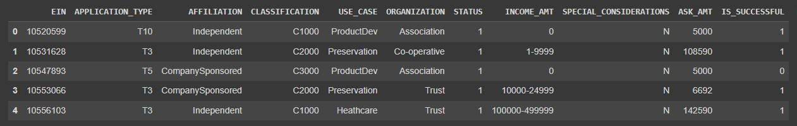

## Overview
The analysis presented here involves a fictional nonprofit foundation named “Alphabet Soup”. The foundation provides funding to various organizations for their ventures. The foundation wants a tool that can help it to determine which organization requests have the best chance of success.

## Data Preprocessing
The dataset contains the following headers:

- The target for the analysis is “is_successful”, since this is ultimately what the model will try to determine.
- The features includes every column except “is_successful”. The columns in the initial analysis “Name and EIN” were dropped as they are deemed to be labels rather than features, although in later analysis they may be added in later to understand if perhaps organization name can change the model.

## Compiling, Training, and Evaluating the Model
- Layers: Online literature (https://web.archive.org/web/20140721050413/http://www.heatonresearch.com/node/707) suggests that two hidden layers would be sufficient for neural network tasks, with no reason to choose higher values. Performance with two layers was deemed sufficiently fast enough to run multiple iterations without issue, so two layers were chosen.
- Activation Functions: ReLU was used as it is generally a decent default choice for most hidden layers. 
- Neurons: For the sake of efficiency and to prevent an overfitting scenario, a small number of neurons were chosen, with the first layer having 6 and the second layer having 4 neurons. This follows convention with the second layer having 2/3 the number of neurons as the first.  A few “test runs” were done and determined that this combination provided good performance without significant overfitting. 
- Unfortunately, with an initial attempt, model performance of 72% was achieved, which is below the goal of 75%. 

## What steps did you take in your attempts to increase model performance?
- The first step was to increase the number of neurons and epochs taken to train the model. This runs a risk of overfitting, but would be a “quick” way to determine if the actual model performance can be improved. 
- An attempt was used to reintroduce EIN back into the dataset. The original assumption was that the EIN and Name of the organizations in the dataset are merely labels; however, it can be argued that the actual organization can in fact be considered a “Feature”, since there exists the possibility that certain organizations have more successful outcomes despite other metrics predicting bad outcomes. 
- With these attempts, the model performance on the training data did reach over 75%. However, on test dataset the accuracy and loss still doesn’t quite correspond to 75% plus

## Summary: 
- The initial model was created using 6 neurons for the 1st ReLU activation layer and 4 for the 2nd ReLU activation layer. The initial model did not demonstrate over 75% performance after running 100 epochs. 
- With some changed parameters the model was eventually able to reach 75%. However, on test datasets the model still isn’t demonstrating the target performance, only improving to 73% from the initial model. The parameters investigated including changing the number of neurons, and including the EIN back within the features dataset. 
- One possible model that could be used to solve this classification problem is a pre-trained model that is focussed on classification of money lending and loans.  This would provide a model that has been trained on a much larger dataset, or can be used to determine if there are other features that could be extracted from AlphabetSoup’s dataset that would help improve predictions.

